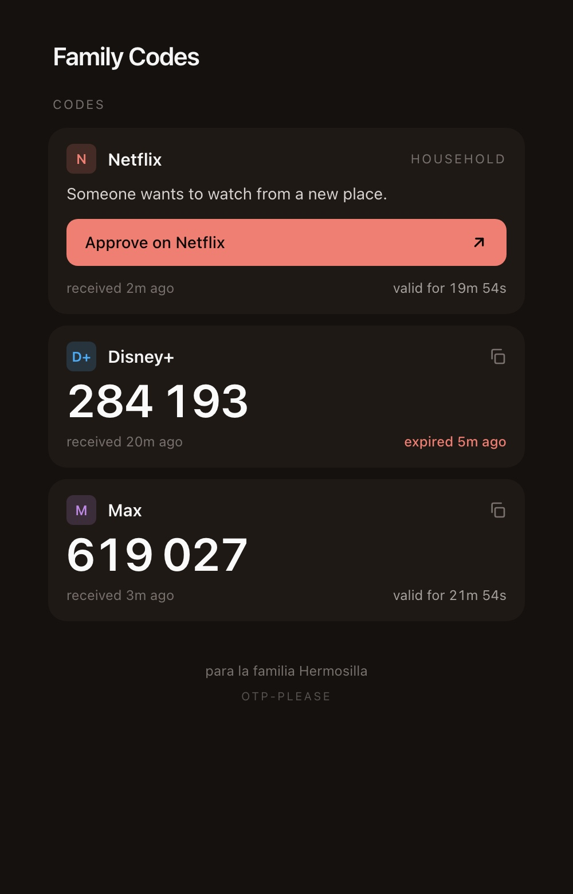

# otp-please 🍿

[](https://github.com/ignaciohermosillacornejo/otp-please/actions/workflows/test.yml)
[](https://github.com/ignaciohermosillacornejo/otp-please/releases)
[](./LICENSE)
[](https://workers.cloudflare.com/)
[](https://www.typescriptlang.org/)

"¿Me pasas el código?"

If you are the "account owner" for your family, you are also the unofficial, unpaid SMTP-to-WhatsApp gateway. Every time a guest signs in or a session expires, you’re interrupted mid-meeting (or mid-padel set) to hunt through Gmail and read out six digits.

otp-please is a serverless Sanity Defense System. It intercepts streaming service OTPs (Netflix, Disney+, Max) and "Household" approval links, extracting the signal from the noise and parking it on a secure, self-serve dashboard.

<p align="center">

</p>

## The "Manual Middleware" SLA

As an engineer, the manual workflow was a failure of distributed systems. This project moves the logic to the edge:

| Metric | **Legacy (Manual Forwarding)** | **`otp-please` (Edge Automated)** |
| :--- | :--- | :--- |
| **p50 Latency** | ~8 minutes (*"un momento"*...) | < 10 seconds (Total trip time) |
| **Throughput** | Limited by your patience | Infinite (Let them sign in 100x) |
| **Padel Sets Interrupted** | Non-zero, shameful | **Zero, as God intended** |
| **The "Mom" Factor** | High (WhatsApp pings every 2 mins) | Residual (She's learning, bless her) |

## What it does

When a configured streaming service sends an OTP email to the account owner's Gmail, a Gmail filter forwards a copy to a Cloudflare Email Routing address. An Email Worker parses the message, extracts the code (or, for Netflix Household, the approval link), and writes it to Workers KV. A mobile-first dashboard — gated by Cloudflare Access so only the authorized family members can reach it — shows the current code per service with a live countdown, hides it once the grace window expires, and forgets the whole thing an hour after it mattered.

Supported today:

- **Netflix Household** — "update primary location" / travel approval link. Approval is currently "open the link, only works from the home network" with an on-page warning for travelers; a future version will gate this by tailnet presence so the link is only surfaced when the viewer is actually on the home LAN.
- **Disney+** — 6-digit verification code.
- **Max** — 6-digit verification code.

Adding a service is cheap — see the [Adding a new service](#adding-a-new-service) walkthrough. Removing a family member who still texts you anyway is out of scope.

## Architecture

No home server. No Docker. All compute runs on Cloudflare's edge.

```
┌──────────────────────────────────────────────────────┐
│  Streaming service emails account owner's Gmail      │
│  → Gmail filter forwards matching mails to           │
│    codes@<your domain>                               │
│  → Original copy stays in inbox (filter does NOT     │
│    "Skip Inbox") — permanent audit trail             │
└──────────────────────┬───────────────────────────────┘
                       │ SMTP
                       ▼
┌──────────────────────────────────────────────────────┐
│  Cloudflare Email Routing                            │
│  codes@<domain> → Email Worker `otp-please`          │
│  catch-all *@<domain> → personal inbox (safety net)  │
└──────────────────────┬───────────────────────────────┘
                       │ Worker invocation
                       ▼
┌──────────────────────────────────────────────────────┐
│  Cloudflare Worker `otp-please`                      │
│                                                      │
│  email() handler:                                    │
│   - Verifies envelope-from matches TRUSTED_FORWARDER │
│     (CF's MX has already attested SPF at ingest)     │
│   - Parses MIME via postal-mime                      │
│   - Per-service pattern matching                     │
│   - Writes StoredEntry to KV with 1h grace TTL       │
│                                                      │
│  fetch() handler (gated by Cloudflare Access):       │
│   - GET /        → dashboard HTML                    │
│   - GET /api     → JSON of current entries           │
│   - GET /healthz → 200 ok (exempt from Access)       │
└──────────────────────────────────────────────────────┘
```

## Setup

**Prerequisites**

- A Cloudflare account with your domain on Cloudflare DNS.
- Node 20+.
- `wrangler` (installed as a devDependency of this repo — `npx wrangler` works out of the box — or globally if you prefer).

**Steps (in order)**

1. **Clone, install, and log in to Cloudflare:**
   ```bash
   git clone https://github.com/ignaciohermosillacornejo/otp-please.git
   cd otp-please
   npm install
   npx wrangler login
   ```

2. **Create the KV namespace** and paste the id into `wrangler.toml`:
   ```bash
   npx wrangler kv namespace create OTP_STORE
   ```
   The CLI prints an `id = "..."` line. Open `wrangler.toml` and replace `REPLACE_WITH_KV_NAMESPACE_ID` with that id.

3. **Set personal values in `wrangler.toml`:**
   - `TIMEZONE` — your IANA timezone. `America/Santiago` ships as the default — change it to your own (e.g. `America/New_York`, `Europe/Madrid`).
   - `DASHBOARD_TITLE` — whatever you want at the top of the page (e.g. `"Family Codes"`).
   - `FOOTER_TEXT` — optional line shown in the page footer. Leave as `""` if you don't want one.
   - `TAILSCALE_PROBE_URL` — leave empty (`""`) for now. This is a P1 placeholder for home-network gating of the Netflix Household link (resolving only from the tailnet); it isn't wired up in P0, and an empty value is the correct default.

4. **Deploy the Worker:**
   ```bash
   npx wrangler deploy
   ```

5. **Set your trusted forwarder as a Worker secret** (kept out of git so your Gmail address isn't in the commit history):
   ```bash
   npx wrangler secret put TRUSTED_FORWARDER
   ```
   Paste your Gmail address (e.g. `you@gmail.com`) when prompted. This is the **only** sender the Worker will accept mail from; everything else is dropped. At runtime `env.TRUSTED_FORWARDER` resolves to this value just like a regular `[vars]` entry. If you forget this step, every incoming mail will be rejected and you'll see `skip: forwarder verification failed` in `wrangler tail`.

6. **Cloudflare dashboard — Email Routing:**
   - Go to *your domain → Email → Email Routing*.
   - Enable it if it isn't already (this provisions the required MX records).
   - Create a custom address `codes@<yourdomain>` that forwards to **your personal inbox** *temporarily*. This is only so the Gmail verification email in step 7 arrives somewhere you can read it. You'll change this destination in step 9.

7. **Gmail — register the forwarding address:**
   - Gmail → *Settings → Forwarding and POP/IMAP* → *Add a forwarding address* → enter `codes@<yourdomain>`.
   - Gmail sends a verification code to that address. Cloudflare Email Routing forwards it to your inbox (per step 6). Copy the code and paste it back into Gmail.
   - Once verified, **do NOT** enable automatic forwarding globally. You'll use a filter (step 8) so only OTP mails get forwarded.

8. **Gmail — create the forwarding filter:**
   - Gmail → *Settings → Filters and Blocked Addresses* → *Create a new filter*.
   - Criteria (From):
     ```
     from:(@account.netflix.com OR @mailer.netflix.com OR @disneyplus.com OR @mail2.disneyplus.com OR @mail.disneyplus.com OR @max.com OR @hbomax.com OR @alerts.hbomax.com OR @service.hbomax.com)
     ```
     This covers every sender domain matched by `PATTERNS` in `src/parser.ts`, including the legacy `@hbomax.com` / `@service.hbomax.com` addresses the parser still accepts for backwards-compat and the `@mailer.netflix.com` / `@mail.disneyplus.com` variants some services use. Add or remove entries to match the services you actually use; `src/parser.ts` is the authoritative list.
   - Actions: **Forward it to `codes@<yourdomain>`** (pick the previously-verified address).
   - **Do NOT check "Skip the Inbox".** You want the original email to stay in your inbox as an audit trail and manual fallback.
   - Save.

9. **Cloudflare dashboard — flip Email Routing to the Worker:**
   - Back in *Email Routing*, edit the `codes@<yourdomain>` route.
   - Change the destination from "Send to email" to "Send to Worker", and pick `otp-please`.
   - Keep (or add) a catch-all `*@<yourdomain>` route pointing at your personal inbox as a safety net.

10. **Cloudflare Access — protect the dashboard:**
    - *Zero Trust → Access → Applications → Add an application → Self-hosted*.
    - Application domain: your Worker's hostname (either the default `otp-please.<subdomain>.workers.dev` or a custom `codes.<yourdomain>` if you mapped one).
    - Identity provider: Cloudflare's built-in **One-Time PIN** (email magic-link / six-digit code). No Google Workspace / OAuth app needed — users type their email, Cloudflare sends them a code.
    - Policy: email allowlist containing the family Gmail addresses that should be able to see the dashboard.
    - **Bypass rule:** path `/healthz` — exempt from auth so uptime monitors (and Cloudflare itself) can probe it without a cookie.
    - **Session duration: 1 month (720h).** Both dials matter — raise them together, or the shorter one wins:
      - *Application session duration*: on the app itself, *Configure → Session Duration → 1 month*. This controls how long the app-hostname cookie stays valid.
      - *Global session duration*: account-wide, under *Access controls → Access settings → Set your global session duration → 1 month*. This controls how often users are bounced back to Google to re-authenticate. Default is 24h, which would re-prompt the household every day even with the app dial at a month.
      The 24h default is reasonable for a corporate Access deployment; for a family OTP relay it just trains everyone to click through auth prompts. 720h is the longest Access offers.

11. **Trigger a test OTP** on one of the configured services (e.g. sign out of Netflix and sign back in). In a terminal, watch the live logs:
    ```bash
    npx wrangler tail
    ```
    You should see something like `info: stored code for netflix (valid 15m)`. Open the dashboard URL and confirm the code appears.

## Adding a new service

1. Add a new `Pattern` entry to `PATTERNS` in `src/parser.ts`. You need a `senderMatch` regex, either a `codeRegex` (for OTPs) or a `linkRegex` (for approval links), and a `validForMinutes`. Add a `bodyRequire` if the sender is shared across products and you need a body substring to disambiguate (useful for generic transactional senders).
2. Add the new service name to `SERVICE_KEYS` at the top of `src/parser.ts`. TypeScript enforces that `ServiceKey` stays in sync.
3. Add a display-name + Tailwind accent colors to `SERVICE_META` in `src/dashboard.ts`, and add the service to `DISPLAY_ORDER` so the card shows up in the layout.
4. Drop a sanitized `.eml` fixture into `test/fixtures/` and add a matching test in `test/parser.test.ts`. Fixtures use obviously-fake values like `FAKE_TRAVEL_TOKEN_0002` or sequential digits (`123456`).
5. Update the Gmail filter in [setup step 8](#setup) to include the new sender address.
6. `npm test` → `npx wrangler deploy`.

## Debugging

```bash
# Follow live Worker logs (email + fetch):
npx wrangler tail

# List every KV entry:
npx wrangler kv key list --binding=OTP_STORE

# Read a specific entry:
npx wrangler kv key get --binding=OTP_STORE entry:disney
```

Common failure modes and what they mean:

- **`skip: forwarder verification failed`** — the inbound message's envelope-from did not match your configured `TRUSTED_FORWARDER` (after Gmail-dot/case normalization). Either the secret isn't set (run `npx wrangler secret put TRUSTED_FORWARDER`), or the filter is forwarding from a different Gmail account than the one you configured. The log line includes the raw and normalized envelope-from vs the configured value and an `matched=false` marker — compare those to what you see in Gmail's filter settings and in the Cloudflare Email Routing Activity tab.
- **`skip: no pattern matched for "..." from ...`** — the sender address or body didn't match any entry in `PATTERNS`. The log includes the subject and parsed `from`; compare them against `src/parser.ts` and adjust the regex if the service has changed its email template.
- **`err: KV write failed for <service>: ...`** — a transient KV put failure. The Worker does NOT retry on purpose (see the [Security model](#security-model) below) — the next email from the same service will simply overwrite the key. If you see this repeatedly, check Cloudflare status.
- **Empty dashboard but `wrangler tail` shows stored entries** — either the codes already expired past the 1-hour grace window (`filterStaleEntries` in `src/kv.ts` drops them at read time, even if KV's own TTL hasn't reaped the row yet), or the KV namespace id in `wrangler.toml` doesn't match the one the dashboard binding reads from. Run `npx wrangler kv key list --binding=OTP_STORE` to confirm what's actually stored.
- **`wrangler dev` always rejects emails** — Worker secrets are not exposed to `wrangler dev`. Copy `.dev.vars.example` to `.dev.vars` and set `TRUSTED_FORWARDER="..."` to a value `wrangler dev` can feed as an env var. `.dev.vars` is gitignored so it won't land in the repo.

## Security model

### What this Worker trusts

- **That mail arriving at `codes@<yourdomain>` was forwarded through your Gmail account.** Cloudflare Email Routing's MTA performs SPF/DKIM/DMARC/ARC at ingest (visible in the Email Routing Activity tab as `spf=pass dkim=pass arc=pass Spam=Safe`) and drops anything that fails SPF before this Worker is invoked. So by the time `message.from` reaches the Worker, Cloudflare has already verified the envelope-from is authentic. The Worker compares it to `TRUSTED_FORWARDER` (case-insensitive, Gmail-dot-normalized) and rejects anything else. Anyone who can forge Google's SPF can bypass this; anyone who has compromised your Gmail account has bigger problems than a streaming code.
- **That Cloudflare Email Routing does NOT forward a fresh `Authentication-Results` header into the Worker.** An earlier version of `verifyForwarder` parsed that header and was silently rejecting every legitimate forward — see the JSDoc on `verifyForwarder` in `src/index.ts` for the full story. The current check relies solely on CF's pre-delivery SPF, which is the correct load-bearing signal.
- **That Cloudflare Access reliably gates the `fetch()` handler**, except the `/healthz` bypass, and that your family members sign in with the configured OAuth identities.

### What this Worker does NOT do

- **No DKIM-alignment check** on the original streaming service's signature. The Gmail filter already handles sender selection; a deeper cryptographic check on the original Netflix/Disney/Max signature is P2 work.
- **No persistent state** beyond Workers KV entries. No user list, no history, no session tokens, no audit log. Cold starts have no in-memory carryover.
- **No retry on failed KV writes.** Cloudflare will not re-invoke `email()` on a Worker exception, and that's on purpose — we'd rather drop a code than risk double-delivering one after a partial put.

### Privacy notes

- **Codes and household URLs are stored in KV plaintext.** KV is a shared secret between the Worker and the Cloudflare account owner. There is no additional at-rest encryption on top of what Cloudflare provides.
- **Logs NEVER contain the extracted code or URL.** The Worker logs the service key, the match type, and the validity window — see the `console.log` calls in `src/index.ts`. This is enforced by code review, not by a lint rule.
- **`GET /api` returns the raw entries, including `value`/`url`.** It's behind Cloudflare Access, but a future maintainer adding a new endpoint should be aware that the JSON snapshot is not redacted.
- **The email subject is written into `StoredEntry.subject`.** Some services personalize subjects (e.g. `"Hi Ana, your code is..."`). This is acceptable for a solo family project where the account holder controls both the KV namespace and the dashboard viewer allowlist, but don't expose the dashboard more broadly without rethinking.

## Contributing

PRs welcome. Run `npm test` (and `npm run typecheck`) before submitting. An AI review runs on every PR — see `.github/workflows/` for the CI setup, including the Claude-powered PR review and auto-merge flows. If you're adding a new service, please include a sanitized `.eml` fixture and a parser test.

## License

MIT — see [`LICENSE`](./LICENSE).
